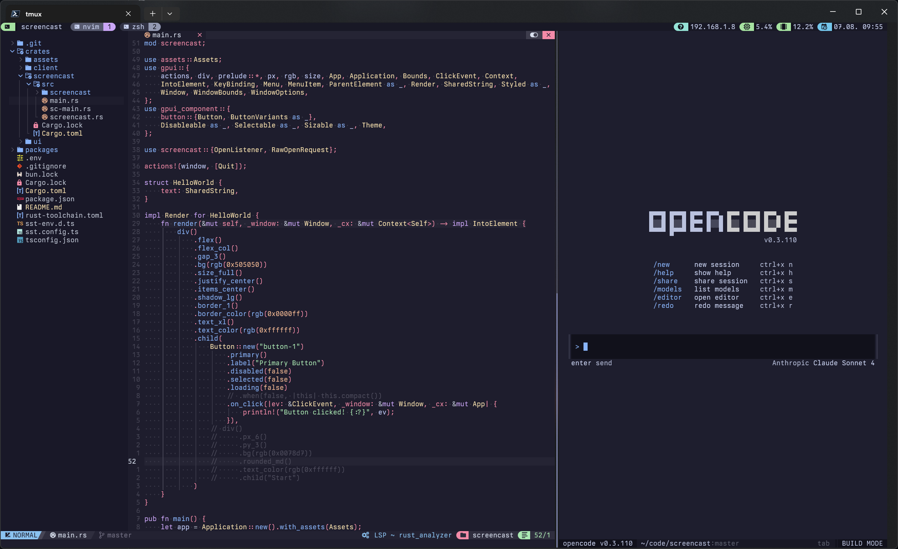

# dotfiles

Personal cross-platform dotfiles, organized as composable modules.

Low coupling, high cohesion: each tool owns its own folder, platform differences are explicit,
shared side effects live in `lib/`, and setup scripts are idempotent.

## Principles

- **Organize by concern, not by file type.** Each tool/environment gets its own folder with its config and scripts.
- **Compose from small modules.** Bootstrap scripts discover and execute `install*` / `init*` modules instead of hardcoding long flows.
- **Keep platform boundaries explicit.** Use OS/shell-specific entrypoints (`*.linux.zsh`, `*.darwin.zsh`, `*.ps1`) to isolate differences.
- **Centralize side effects.** Filesystem linking and similar mutations go through shared helpers, not copy-pasted shell commands.
- **Aim for idempotent setup.** Re-running install should be safe: detect current state, skip no-ops, and back up conflicts.
- **Prefer thin wrappers over custom systems.** Alias/function layers should compose existing tools rather than reimplement them.
- **Externalize secrets.** Store references to a secret manager and agent sockets; keep credentials out of committed config logic.
- **Constrain power by mode.** Define explicit tool/capability boundaries for automation contexts (plan, docs, review).

## Conventions

- Module entrypoints: `module/install.zsh`, `module/install.<os>.zsh`, `module/install.ps1`, `module/init.zsh`, `module/init.ps1`
- Root orchestrators: `install`, `install.ps1`, `init.zsh`, `powershell/profile.ps1`
